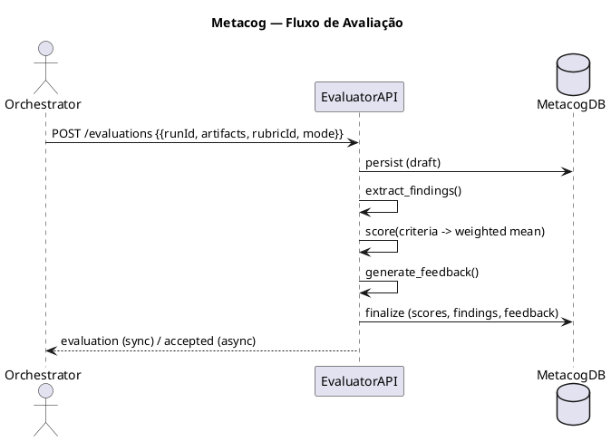

# Metacognition Module — Mono‑repo Service (Full Documentation)
_Data: 2025-10-19_

> **Contexto**
> - Orquestrador FastAPI já expõe Agents/Flows/Orchestrate, Import/Export e UI servida pela API.
> - Diretriz: camada metacognitiva **desacoplada**, interoperável via **HTTP/JSON**, rodando como **serviço separado** no mesmo **monorepo** (dois containers).
> - TDD-first, Docker-first, contratos estáveis com **JSON Schemas** validados no CI.

---

## 1) Visão de Arquitetura

```plantuml
@startuml
title Orchestrator + Metacog (serviço separado no monorepo)

package "monorepo" {{
  package "orchestrator (FastAPI)" {{
    [Agents API]
    [Flows API]
    [Orchestrate API]
    [Engine Adapter]
  }}

  package "metacog (FastAPI)" {{
    [Evaluator API]
    [Rubrics API]
    [Scoring + Checkers]
    [Findings Extractor]
  }}
}

[Orchestrate API] -> [Engine Adapter]: run(flow, engine)
[Engine Adapter] --> [Orchestrate API]: {{output, trace, logs}}

[Orchestrate API] -> [Evaluator API]: POST /evaluations {{runId, artifacts, rubricId, mode}}
[Rubrics API] <- [UI]: CRUD de rúbricas

database "DB orchestrator" as DBo
database "DB metacog" as DBm

[Agents API] --> DBo
[Flows API] --> DBo
[Evaluator API] --> DBm
@enduml
```

**Princípios**
- Serviço próprio (porta própria), comunicação **HTTP/JSON**.
- **Contratos estáveis** + **JSON Schemas** versionados.
- **Feature flag** no orquestrador (`eval=off|sync|async`) para ativar avaliação.
- Observabilidade e segurança isoláveis.

---

## 2) API do Metacog (Contratos)

### 2.1 `POST /evaluations` — criar avaliação (sync/async)
**Request**
```json
{{
  "runId": "r-20251019-001",
  "flowId": "f1",
  "engine": "crewai",
  "rubricId": "rbk-default-v1",
  "inputs": {{ "prompt": "..." }},
  "artifacts": {{
    "output": "texto do agente...",
    "trace": {{ "nodes": [ {{ "id": "n1", "agentId": "a1", "logs": ["..."] }} ] }}
  }},
  "mode": "sync"
}}
```

**Response (sync)**
```json
{{
  "evaluationId": "ev-001",
  "runId": "r-20251019-001",
  "rubricId": "rbk-default-v1",
  "scores": {{ "task_success": 0.9, "consistency": 0.8, "groundedness": 0.7, "safety": 1.0, "latencyMs": 1234 }},
  "criteria": [
    {{ "id": "C1", "name": "Clareza", "weight": 0.2, "score": 0.9, "notes": "…" }}
  ],
  "findings": [
    {{ "type": "risk", "code": "LEAK-CTX", "message": "Possível vazamento de contexto", "nodeId": "n1", "severity": "medium" }}
  ],
  "feedback": {{
    "summary": "Boa cobertura; revisar citações.",
    "actions": [ "Adicionar verificação de fontes no nó n1" ]
  }},
  "artifactsRef": "local://metacog/runs/r-20251019-001/ev-001",
  "createdAt": "2025-10-19T17:00:00Z"
}}
```

### 2.2 `GET /evaluations?runId=...`
```json
{{
  "items": [
    {{ "evaluationId": "ev-001", "rubricId": "rbk-default-v1", "scores": {{ "task_success": 0.9 }}, "createdAt": "..." }}
  ]
}}
```

### 2.3 `GET /rubrics/{rubricId}`
```json
{{
  "rubricId": "rbk-default-v1",
  "name": "Padrão — Generalista",
  "criteria": [
    {{ "id": "C1", "name": "Clareza", "desc": "Linguagem clara", "weight": 0.2, "scale": [0,1] }}
  ],
  "scoring": {{ "method": "weighted_mean" }},
  "version": "1.0.0"
}}
```

### 2.4 `POST /rubrics`
Corpo igual ao de leitura; versionamento por `version`.

---

## 3) JSON Schemas (draft-07)

### 3.1 `schemas/Rubric.json`
```json
{{
  "$schema":"http://json-schema.org/draft-07/schema#",
  "title":"Rubric",
  "type":"object",
  "properties":{{
    "rubricId":{{"type":"string"}},
    "name":{{"type":"string"}},
    "criteria":{{"type":"array","items":{{
      "type":"object",
      "properties":{{
        "id":{{"type":"string"}},
        "name":{{"type":"string"}},
        "desc":{{"type":"string"}},
        "weight":{{"type":"number"}},
        "scale":{{"type":"array","items":{{"type":"number"}},"minItems":2,"maxItems":2}}
      }},
      "required":["id","name","weight","scale"],
      "additionalProperties":false
    }}}},
    "scoring":{{"type":"object","properties":{{"method":{{"type":"string"}}}}}},
    "version":{{"type":"string"}}
  }},
  "required":["rubricId","name","criteria","version"],
  "additionalProperties":false
}}
```

### 3.2 `schemas/EvaluationResult.json`
```json
{{
  "$schema":"http://json-schema.org/draft-07/schema#",
  "title":"EvaluationResult",
  "type":"object",
  "properties":{{
    "evaluationId":{{"type":"string"}},
    "runId":{{"type":"string"}},
    "rubricId":{{"type":"string"}},
    "scores":{{"type":"object","additionalProperties":true}},
    "criteria":{{"type":"array","items":{{
      "type":"object",
      "properties":{{
        "id":{{"type":"string"}},
        "name":{{"type":"string"}},
        "weight":{{"type":"number"}},
        "score":{{"type":"number"}},
        "notes":{{"type":"string"}}
      }},
      "required":["id","weight","score"],
      "additionalProperties":false
    }}}},
    "findings":{{"type":"array","items":{{
      "type":"object",
      "properties":{{
        "type":{{"type":"string"}},
        "code":{{"type":"string"}},
        "message":{{"type":"string"}},
        "severity":{{"type":"string"}},
        "nodeId":{{"type":"string"}}
      }},
      "required":["type","code","message"],
      "additionalProperties":false
    }}}},
    "feedback":{{"type":"object","properties":{{"summary":{{"type":"string"}},"actions":{{"type":"array","items":{{"type":"string"}}}}}},"additionalProperties":false}},
    "artifactsRef":{{"type":"string"}},
    "createdAt":{{"type":"string"}}
  }},
  "required":["evaluationId","runId","rubricId","scores","createdAt"],
  "additionalProperties":false
}}
```

---

## 4) Fluxo Interno (Core)



**Mechanics**
- Extractors: `structure_checks`, `consistency_checks`, `safety_checks`, `groundedness` (quando houver `references`).
- Scoring: escala 0–1, agregação por média ponderada da rúbrica.
- Feedback: resumo + ações por `nodeId` (apoia refino de prompts/fluxos).

---

## 5) Dados & Persistência

**Tabelas**
- `evaluations(evaluation_id pk, run_id, rubric_id, scores jsonb, created_at)`
- `findings(evaluation_id fk, type, code, message, severity, node_id)`
- `rubrics(rubric_id pk, name, criteria jsonb, version)`
- `artifacts(evaluation_id fk, ref, kind, format)`

---

## 6) Integração no Orquestrador

- Rota existente: `POST /orchestrate/run` (engine `crewai|robotgreen`).
- Extensão (sem breaking change):
  - Query params: `eval=off|sync|async` (default `off`), `rubricId=rbk-default-v1`.
  - Se `eval!=off`, o orquestrador faz `POST metacog/evaluations` e agrega a resposta ao retorno.

**Resposta estendida (exemplo)**
```json
{{
  "result": {{ "output": "..." }},
  "logs": ["..."],
  "evaluation": {{ "scores": {{ "task_success": 0.9 }}, "evaluationId": "ev-001" }}
}}
```

---

## 7) Deploy Local (Docker Compose)

```yaml
services:
  orchestrator:
    build: ./orchestrator
    env_file: .env
    ports: ["8080:8080"]
    depends_on: [metacog]

  metacog:
    build: ./metacog
    env_file: .env
    environment:
      - METACOG_DB_URL=sqlite:///data/metacog.db
      - METACOG_DEFAULT_RUBRIC=rbk-default-v1
      - METACOG_LOG_LEVEL=INFO
    volumes:
      - ./data:/app/data
    ports: ["8081:8081"]
```

**.env.example (trechos)**  
```
# Orchestrator → Metacog
METACOG_BASE_URL=http://metacog:8081
EVAL_MODE=off   # off|sync|async
EVAL_DEFAULT_RUBRIC=rbk-default-v1

# Metacog
METACOG_DB_URL=sqlite:///data/metacog.db
METACOG_LOG_LEVEL=INFO
```

**Como rodar**
```bash
cp .env.example .env
docker compose up --build
```

---

## 8) Segurança & Observabilidade

- **RBAC**: token de serviço para `POST /evaluations` e `POST /rubrics`.
- **Auditoria**: `artifactsRef` aponta para `data/` (fase 1); S3/Postgres depois.
- **OpenTelemetry**: spans para `evaluate()`, atributos `runId`, `rubricId`, `latencyMs`, `scores.*`.
- **Limites**: sanitização de entrada; tamanhos máximos configuráveis.

---

## 9) CI/CD (Contrato & Qualidade)

- Validar JSON Schemas (`ajv` ou `python-jsonschema`) em cada PR.
- Testes de contrato entre serviços (sucesso/erro/timeout).
- Cobertura mínima ≥ 70% (API + core).

---

## 10) Estrutura de Pastas (serviço `metacog/`)

```
metacog/
  app/
    api/
      evaluations.py
      rubrics.py
    core/
      scoring.py
      feedback.py
      extractors/
        structure.py
        consistency.py
        safety.py
        groundedness.py
    models/
      pydantic.py
      orm.py
    repo/
      evaluations.py
      rubrics.py
      findings.py
      artifacts.py
    infra/
      db.py
      settings.py
      otel.py
  tests/
    api/
    core/
    repo/
  Dockerfile
  pyproject.toml
  README.md
```

---

## 11) Critérios de Aceite (MVP Metacog)

- `POST /evaluations` retorna nota agregada + critérios + findings.
- `GET /evaluations?runId=...` lista avaliações por execução.
- Rúbrica default `rbk-default-v1` disponível via API.
- CI valida schemas e contratos; testes cobrindo erros/normalização; DX consistente.

---

## 12) Próximos Passos (copiar e colar)

1. **Criar pasta `metacog/`** (estrutura acima), adicionar Dockerfile e FastAPI mínimo com rotas.
2. **Adicionar `metacog` no `docker-compose.yml`** (trecho acima).
3. **Implementar schemas** em `schemas/` e ligar **validação no CI**.
4. **Estender `POST /orchestrate/run`** com `?eval=sync|async&rubricId=...`.
5. **Adicionar testes** (API/core/repo) e badge de cobertura.

---

_Fim do documento._
